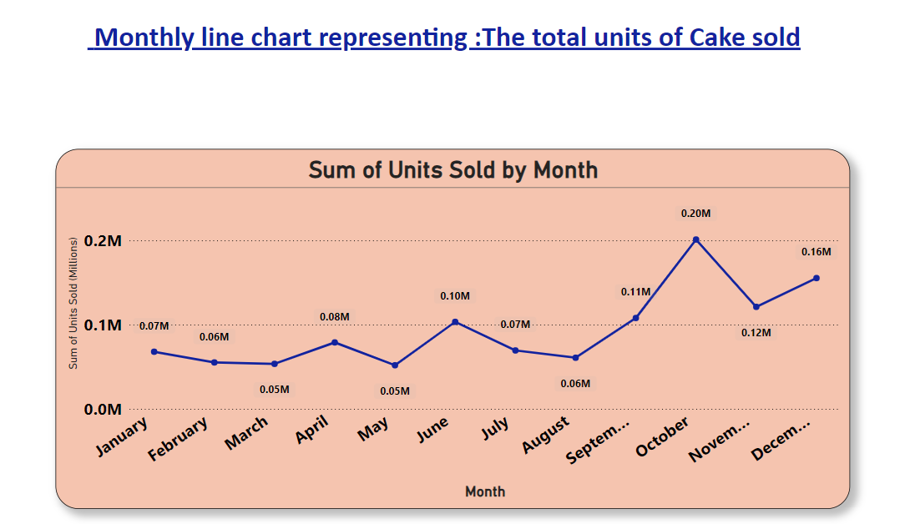
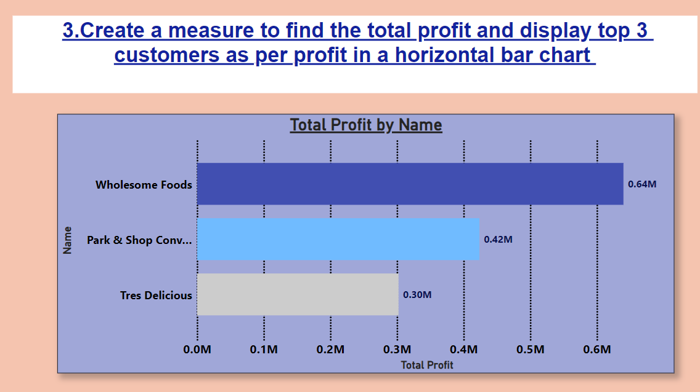
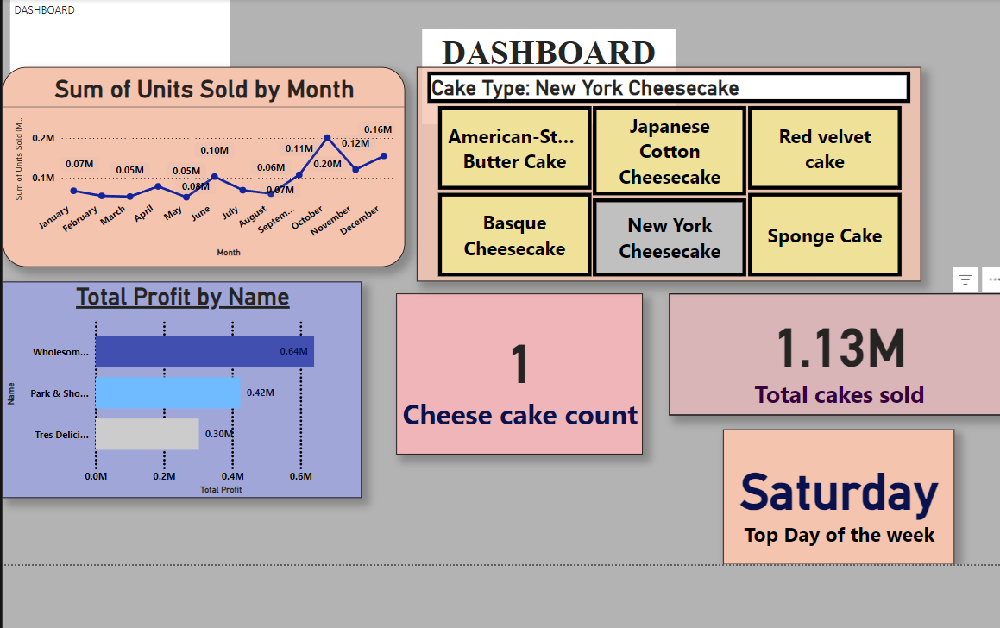

# Power BI Analysis Project: Cake Sales

This repository contains a Power BI analysis project focused on analyzing the monthly sales of cakes. The dashboard provides insights into the sales trends, highlights significant patterns, and identifies seasonal peaks.

## Project Overview
The project aims to visualize and analyze the sales data of cakes over a 12-month period. The analysis is designed to:
- Track monthly sales trends.
- Highlight peak sales months.
- Provide actionable insights for business decisions.

## Key Features
- **Monthly Sales Trends**: A line chart showcasing the fluctuation of sales over the months.
- **Comparison of Monthly Sales**: A bar chart representing the total sales by month.
- **Comprehensive Dashboard**: A Power BI dashboard combining multiple visualizations for in-depth analysis.

## Screenshots
### Line Chart

### Bar Chart

### Full Dashboard

## Insights
- Sales peak in **October** with **0.2M units sold**.
- Lowest sales observed in **June and March**, both with **0.05M units sold**.
- A steady rise in sales begins in **September**, continuing into the holiday season.

## Technologies Used
- **Power BI**: For creating the dashboard and visualizations.
- **Excel/CSV**: For data storage and manipulation.
